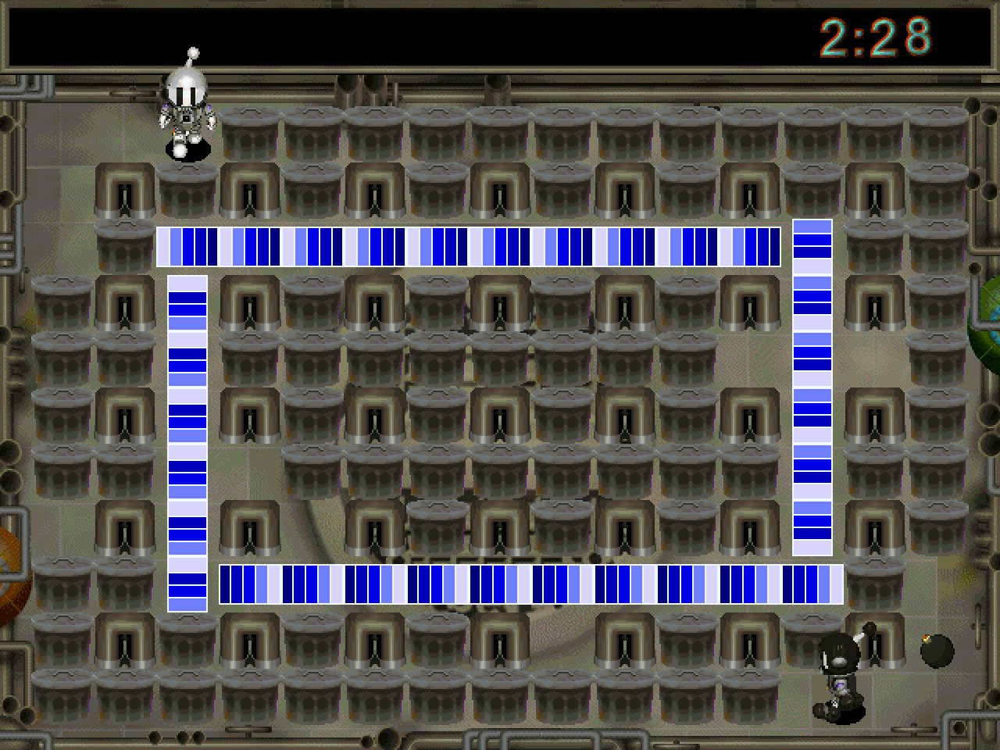

# Open Bomberman

A clean-room, modern **C++20** rewrite of **Atomic Bomberman** (Interplay, 1997) — a deterministic re-implementation that renders the original game with the assets from *your own* copy, and adds **online multiplayer** the 1997 game never shipped in a form that survives modern networks.


**Status:** playable. Faithful deterministic sim (movement, bombs, kick/punch/grab/throw, spooger, the nine diseases, HURRY wall-close, conveyors/warpholes/trampolines, head hits), original art/sound/music loaded at runtime, random stage rotation, a scheme editor, and **online 2-player multiplayer over UDP** (deterministic lockstep + GGPO-style rollback netcode) reachable from the menu or the CLI. A larger lobby/internet/N-player online mode is actively being built — see *Roadmap*.



> The screenshots show the clean-room engine running with the original game's assets, loaded at runtime from a copy you own — see *Legal*.

## Built entirely with Claude Code — no code typed by hand

This is an experiment in fully AI-authored software. **Every line in this repository — the reverse-engineering notes, the clean-room C++ port, the deterministic simulation, the SDL3 presentation layer, the test suites, the online netcode, and the build system — was written by Claude (Anthropic's coding agent, driven through [Claude Code](https://claude.com/claude-code)) from natural-language direction.** No source was written by hand.

The human's role was product direction and reverse-engineering guidance — "here's what the original does, make ours match", "the enclosure wall renders wrong", "make multiplayer smooth" — plus running the result and validating it in-game. Claude did the RE distillation, the faithful ports of the original's arithmetic, the tests that pin behaviour, and the netcode. The workflow that made it tractable is the same discipline any team would use: a deterministic core with golden-hash tests, reverse-engineering facts written down before they're ported (`docs/re/`), and decisions recorded as ADRs (`docs/adr/`).

## Features

- **Faithful, deterministic gameplay core** — integer-only 20 Hz sim, ported to mirror the original binary's arithmetic (not paraphrased), with golden-hash tests that freeze behaviour against accidental change.
- **Original assets at runtime** — reads the 1997 ANI/PCX/SCH/RES/RSS formats from your own install; nothing is bundled.
- **Online multiplayer** — deterministic lockstep **and** GGPO-style rollback over UDP, with per-tick `state_hash` desync detection and packet-loss tolerance; play from the menu (*Start / Join Network Game*) or the command line.
- **Presentation extras** with no 1997 equivalent — HD art toggle, a native-cadence "creamy" low-latency mode (F9), FPS/vsync toggles — all kept off the faithfully-reproduced Options screen.
- **Tools** — a headless asset inspector/extractor (`abtool`), an animation viewer (`bomber_viewer`), and a scheme editor.

## Layout

```
libs/assets   loaders for the original formats (ANI, PCX, SCH, RES, RSS) — SDL-free
libs/sim      deterministic 20 Hz gameplay core (state + systems) — dependency-free
libs/match    scheme + VALUELST -> MatchConfig glue (header-only)
libs/net      online netcode: input codec, lockstep + rollback sessions, UDP transport — SDL-free
libs/game     SDL3 presentation: asset store, renderer, audio, input, app shell
apps/         bomber_game (OPEN-BM95), bomber_viewer, abtool (thin mains)
tests/        doctest suites incl. golden-hash behaviour pins + netcode determinism
```

See `CLAUDE.md` for the full architecture and project rules, `docs/re/facts.md` and `docs/adr/` for research notes and decisions.

## Requirements

- An original Atomic Bomberman installation (the game data is **not** included and must never be committed — see `.gitignore`)
- CMake ≥ 3.25
- Windows: Visual Studio 2022; SDL3 comes via FetchContent (`windows-fetch` preset, no vcpkg) or vcpkg (`windows-msvc` preset, `VCPKG_ROOT` set)
- Linux/macOS: any C++20 compiler (SDL3 via FetchContent or system)

## Build

Windows (game + viewer + tools, no vcpkg needed):

```
cmake --preset windows-fetch
cmake --build --preset windows-fetch
```

Headless tools only (no SDL required):

```
cmake --preset headless
cmake --build --preset headless
```

Convenience wrapper: `make run`, `make viewer`, `make test`, `make survey`, `make deploy` (Windows needs GNU make: `winget install ezwinports.make`).

## Running

`OPEN-BM95` (the game) — playable local + online:

```
OPEN-BM95                         # auto-detects the game install, boots to the menu
OPEN-BM95 <game_dir> <scheme>     # explicit install + scheme
```

Player 0: arrows + Right Ctrl/Space (bomb), Right Shift (throw/grab/trigger/punch) · Player 1: WASD + Left Ctrl/E, Left Shift · Esc: quit. Install auto-detection: `BOMBER_GAME_DIR` env var, `gamedir.txt`, or the standard install paths.

### Online multiplayer

**From the menu:** **Start Network Game** opens the *Network Game* list with six rows:

| row | needs a server? | what it does |
|---|---|---|
| **Host Private Game** | yes | Creates a lobby and shows a 6-character **code**. Read it out to a friend. |
| **Host Public Game** | yes | The same, but also listed for anyone to find under *Browse Public Games*. Still joinable by its code. |
| **Join by Code** | yes | Type the host's 6-character code. |
| **Browse Public Games** | yes | Lists the open **public** lobbies — name, players/seats, code. `Enter` joins, `R` refreshes, `Esc` goes back. Rows whose build does not match yours are greyed and marked `VERSION`; they cannot be joined (the server would refuse). |
| **Host LAN Game** | no | Hosts on UDP port 8000 and waits (the original direct path). |
| **Join by IP Address** | no | Enter the host's `IP:port` (default `127.0.0.1:8000`). |

The four **online** rows land in the same **waiting room**: the lobby code sits in the window title, the roster lists every seat (name, host marker, ready state), `Space` toggles your ready flag, the host presses `Enter` to start, `Esc` leaves. Once the host starts, the peers punch a direct UDP path (STUN/hole-punch) — or fall back to the server's relay if their NAT refuses — and the match begins with the **server's** seed and seat assignment. **Join Network Game** (the menu row below) remains the direct `IP:port` join, unchanged.

#### Matchmaker configuration

The online rows talk to a signaling server (`services/matchmaker`, a small Go binary) that never simulates the game — it introduces peers and, when their NATs refuse a direct path, relays their packets. **A public instance is deployed**, so the online rows work out of the box. The URL resolves CLI flag → environment → the compile-time default:

```
OPEN-BM95 --matchmaker ws://127.0.0.1:8080/ws     # 1. CLI flag (e.g. your own server)
set BOMBER_MATCHMAKER_URL=ws://127.0.0.1:8080/ws  # 2. environment
                                                  # 3. the deployed default (game_app.cpp)
```

> The signaling connection is currently plain `ws://`, not `wss://`: IXWebSocket v11.4.6's mbedTLS backend does not compile against any single mbedTLS release, so the client is built without TLS for now. It carries no credentials — a lobby code, your chosen display name, and the candidate `ip:port`s peers exchange with each other anyway — but it is readable on the path, so treat a "private" lobby code as semi-public until TLS lands.

The UDP **STUN** echo resolves the same way (`--matchmaker-stun <host[:port]>`, `BOMBER_MATCHMAKER_STUN_HOST` / `BOMBER_MATCHMAKER_STUN_PORT`) and defaults to the matchmaker URL's own host on **port 8081**. To run a server locally:

```
go build -o mm.exe ./services/matchmaker && ./mm.exe
```

`ctest -R net_lobby_live` exercises the whole lobby stack against a running server when `BOMBER_MATCHMAKER_URL` is set (it skips otherwise).

**From the CLI** (both peers, same seed → identical arena):

```
OPEN-BM95 --host 8000 127.0.0.1 8001 --seed 0x1234
OPEN-BM95 --join 8001 127.0.0.1 8000 --seed 0x1234
```

For play across machines, replace `127.0.0.1` with the other machine's LAN IP (same ports/seed). The peers cross-check `state_hash` every tick and report a desync loudly if their builds or configs differ.

`abtool` — headless asset inspector/extractor; `bomber_viewer` — SDL3 animation viewer. See their `--help` / the source headers for usage.

## Tests

`ctest` runs the doctest suites: determinism (10k-tick lockstep), gameplay rules, movement (faithful `sub_41EC84` port), diseases, the netcode (loopback lockstep, rollback, real-UDP round-trip, seed handshake), and the golden-hash pins that freeze sim behaviour. Full verification against an original install: `abtool survey` and `bomber_viewer --selftest`.

## Git hooks

`lefthook.yml` wires a pre-push gate: full `headless` build + `ctest`, plus a repo-wide `clang-tidy` pass (config in `.clang-tidy`). Each clone/worktree must enable it once:

```
winget install evilmartians.lefthook   # if not already installed
lefthook install
```

Run either check by hand with `bash scripts/test.sh` / `bash scripts/lint.sh`, or the whole gate with `lefthook run pre-push --force`.

## Roadmap

The online mode is being expanded toward the original's full multiplayer: **>2 players**, a proper **lobby** (short shareable lobby codes for private matches, a public match list, host-starts-while-others-join), **internet play across NATs** (STUN/hole-punching with a relay fallback), and **cross-platform** matches. See `docs/adr/` and `docs/re/multiplayer.md`.

## Contributing

Contributions are welcome — issues and pull requests both. A few house rules keep the project legally clean and the sim trustworthy:

- **Clean-room only.** Base gameplay changes on the reverse-engineering *facts* in `docs/re/` (or add a new, cited fact). Do **not** paste decompiled/disassembled code, and never add original game assets to the repo.
- **Keep the sim deterministic.** `libs/sim` is integer-only, I/O-free, and pinned by golden-hash tests; a deliberate behaviour change updates the golden constants in the same commit and cites its `facts.md` entry. See the "Determinism contract" in `CLAUDE.md`.
- **Land with tests** and keep the suite green. Enable the pre-push hook (above) so the build + tests + `clang-tidy` run before you push.
- Read `CLAUDE.md` — it's the architecture map and the coding standards, and it's the same brief the AI works from.

## Legal

Open Bomberman is an independent, **clean-room re-implementation**. It is **not** affiliated with, endorsed by, or connected to Interplay Entertainment or Konami.

- **No original code or assets are included.** This repository contains only original source authored by the contributors, written from observing data formats and behaviour. It contains no Interplay/Konami code, artwork, audio, level data, or other assets, and the reverse-engineering working material (the binary, disassembly, decompiler output) is never committed either (see `.gitignore`).
- **You must own the original game.** The engine loads Atomic Bomberman's data at runtime from *your own* legally-obtained copy; it ships none of it. Without an original install there is nothing to play.
- **Trademarks.** "Atomic Bomberman" and "Bomberman" and all related names, logos, characters, and artwork are the property of their respective owners (Interplay / Konami). They are used here only nominatively, to describe what this software is compatible with.
- **License.** The original source and documentation in this repository are released under the MIT License — see [`LICENSE`](LICENSE). That license covers the contributors' code **only**; it grants no rights to any third-party names, trademarks, or assets.

If you are a rights holder and have a concern, please open an issue.
