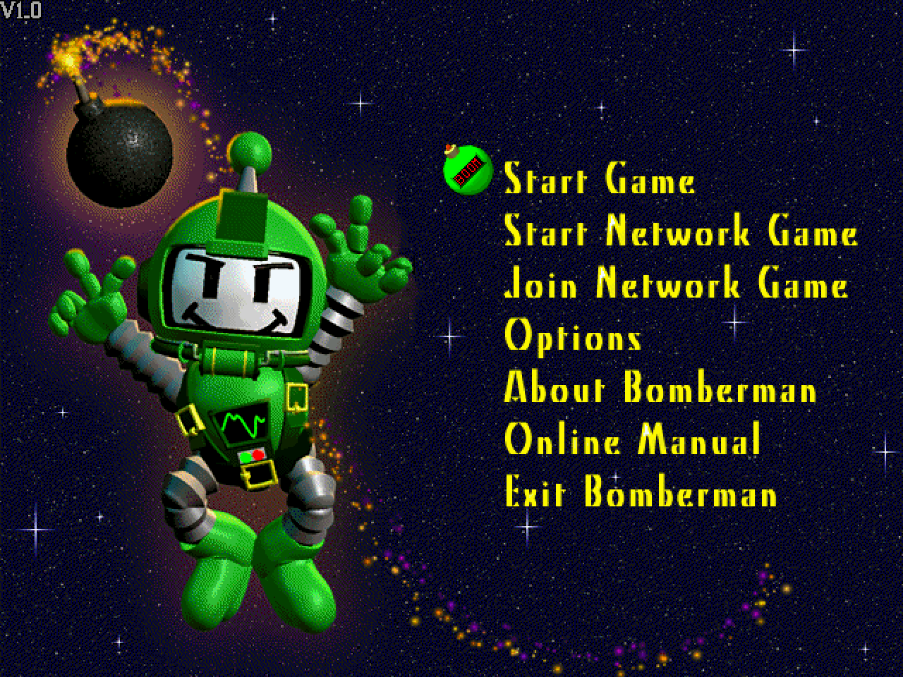
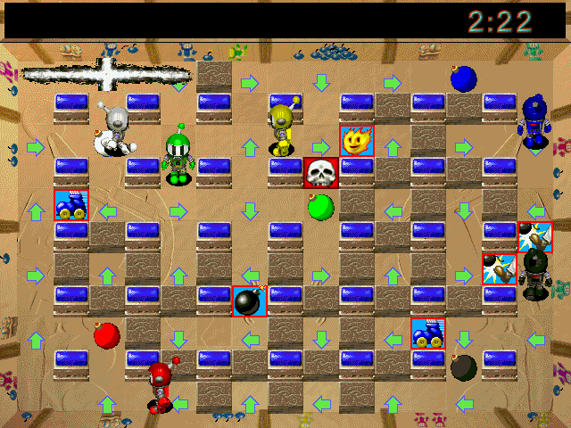

# Open Bomberman

A clean-room, modern **C++20** rewrite of **Atomic Bomberman** (Interplay, 1997) — a deterministic re-implementation that renders the original game with the assets from *your own* copy, and adds **online multiplayer** the 1997 game never shipped in a form that survives modern networks.

<p align="center">
  
</p>

**Status:** playable. Faithful deterministic sim (movement, bombs, kick/punch/grab/throw, spooger, the nine diseases, HURRY wall-close, conveyors/warpholes/trampolines, head hits), original art/sound/music loaded at runtime, random stage rotation, and a scheme editor — plus **online multiplayer over the internet**: share a 6-character lobby code or list your match publicly, and the peers punch a direct UDP path (falling back to a relay when a NAT refuses one) and play on GGPO-style rollback netcode with no input delay. The host sets the match up in the game's own roster and level screens while guests watch, so map choice and AI slots work online exactly as they do locally, and a lobby holds **up to ten machines** — fill the rest of the board with AI if you have fewer.

<p align="center">
  
</p>

> The screenshot and the animation show the clean-room engine running with the original game's assets, loaded at runtime from a copy you own — see *Legal*. The animation is an unedited headless capture of the deterministic sim — six computer players, six seconds of one round, one frame per 20 Hz tick — rendered straight to disk by `--demo-shots` with no display attached.

## Built entirely with Claude Code — no code typed by hand

This is an experiment in fully AI-authored software. **Every line in this repository — the reverse-engineering notes, the clean-room C++ port, the deterministic simulation, the SDL3 presentation layer, the test suites, the online netcode, and the build system — was written by Claude (Anthropic's coding agent, driven through [Claude Code](https://claude.com/claude-code)) from natural-language direction.** No source was written by hand.

The human's role was product direction and reverse-engineering guidance — "here's what the original does, make ours match", "the enclosure wall renders wrong", "make multiplayer smooth" — plus running the result and validating it in-game. Claude did the RE distillation, the faithful ports of the original's arithmetic, the tests that pin behaviour, and the netcode. The workflow that made it tractable is the same discipline any team would use: a deterministic core with golden-hash tests, reverse-engineering facts written down before they're ported (`docs/re/`), and decisions recorded as ADRs (`docs/adr/`).

## Features

- **Faithful, deterministic gameplay core** — integer-only 20 Hz sim, ported to mirror the original binary's arithmetic (not paraphrased), with golden-hash tests that freeze behaviour against accidental change.
- **Original assets at runtime** — reads the 1997 ANI/PCX/SCH/RES/RSS formats from your own install; nothing is bundled.
- **Online multiplayer** — deterministic lockstep **and** GGPO-style rollback over UDP, with per-tick `state_hash` desync detection and packet-loss tolerance; play from the menu (*Start / Join Network Game*) or the command line.
- **Presentation extras** with no 1997 equivalent — HD art toggle, a native-cadence "creamy" low-latency mode (F9), FPS/vsync toggles, and an optional soft (bilinear) upscale for anyone who prefers the smoothed look a modern display scaler gives the 640x480 image — all default-off, and all kept off the faithfully-reproduced Options screen (they live in the port's own F10 panel).
- **Tools** — a headless asset inspector/extractor (`abtool`), an animation viewer (`bomber_viewer`), and a scheme editor.

## Layout

The SDL-free core:

```
libs/core     shared vocabulary: fixed-point unit, field geometry, limits — header-only, no deps
libs/assets   loaders for the original formats (ANI, PCX, SCH, RES, RSS) — SDL-free
libs/sim      deterministic 20 Hz gameplay core (state + systems) — dependency-free
libs/match    scheme + VALUELST -> MatchConfig glue (header-only)
libs/net      online netcode: input codec, lockstep + rollback sessions, UDP transport, lobby client — SDL-free
libs/audio    AudioEngine + SoundBank (the ported selection engine) + SoundDirector
libs/platform engine base: SDL3 frame clock + an SDL-free, unit-tested frame pacer
```

The presentation stack — nine packages, arrows pointing one way only, split out
of what was a single 13k-line `libs/game`:

```
libs/game_util  SDL-FREE models: front-end state machine, results bookkeeping, pixel/pacing rules
libs/input      keyboard, gamepad, DOS-scancode bridge (SDL-free public headers)
libs/render     AssetStore, sprites, sequences, the world Renderer
libs/ui         Screen/ScreenContext, the .BM text viewer, window/dialog/list chrome
libs/netui      net widgets drawn inside another screen: chat overlay, setup link, F3 panel
libs/editor     the .SCH scheme editor's SDL surface
libs/frontend   every screen the player sees, plus MatchRunner
libs/netplay    the online session end to end: lobby, connect/host, best-of-N match
libs/game       the application shell: GameApp — SDL/window lifetime and the AppState loop
```

```
apps/         bomber_game (OPEN-BM95), bomber_viewer, abtool (thin mains)
services/     matchmaker (Go, separate build): lobby control plane + STUN + relay
tests/        doctest suites, one directory per module, incl. golden-hash behaviour pins + netcode determinism
```

See `CLAUDE.md` for the full architecture and project rules, `docs/re/facts.md` and `docs/adr/` for research notes and decisions.

## Requirements

- An original Atomic Bomberman installation (the game data is **not** included and must never be committed — see `.gitignore`)
- CMake ≥ 3.25
- Windows: Visual Studio 2022; SDL3 comes via FetchContent (`windows-fetch` preset, no vcpkg) or vcpkg (`windows-msvc` preset, `VCPKG_ROOT` set)
- Linux/macOS: any C++20 compiler; SDL3 comes via FetchContent (`linux` / `macos` presets). Linux additionally needs the X11/Wayland/ALSA development headers SDL3 builds against — see the *Build* section.

## Build

Windows (game + viewer + tools, no vcpkg needed):

```
cmake --preset windows-fetch
cmake --build --preset windows-fetch
```

Linux and macOS (same shape — SDL3 is fetched and built from source):

```
cmake --preset linux        # or: --preset macos
cmake --build --preset linux
```

On Linux, SDL3 needs the X11/Wayland/audio development headers to build its
backends; the exact package list CI installs is at the top of
[`.github/workflows/c-cpp.yml`](.github/workflows/c-cpp.yml). On macOS,
`scripts/package_macos.sh /path/to/your/BOMBRMAN` goes one step further and
assembles a double-clickable, self-contained `dist/Open Bomberman.app` — SDL3 is
statically linked, so there are no dylibs to bundle, and the game data you point
it at is copied into the app's `Resources/`. Run it on a Mac; it is unsigned, so
the first launch needs right-click → Open.

Headless — no SDL, so no display, X11 or audio headers needed. This is the
configuration the pre-push gate builds, and it is **not** dependency-free: it
still builds the online lobby stack, which fetches IXWebSocket, nlohmann/json
and mbedTLS and compiles mbedTLS from source.

```
cmake --preset headless
cmake --build --preset headless
```

Convenience wrapper: `make run`, `make viewer`, `make test`, `make survey`, `make deploy` (Windows needs GNU make: `winget install ezwinports.make`).

## First-time setup — pointing the engine at your install

The engine ships no game data: it reads the original ANI/PCX/SCH/RES/RSS files
at runtime from *your own* Atomic Bomberman installation. So the one thing to
set up is **where that install lives**.

**The simplest way: copy `OPEN-BM95.exe` into your install folder and run it.**
The executable is fully self-contained — no SDL DLL, and no Visual C++
redistributable either (the MSVC runtime is linked statically), so on Windows it
is a single file that needs nothing installed. Dropped in among the game files
it finds them by itself, whatever the folder is called.

If you would rather keep it elsewhere, the install is resolved in this order,
first hit wins — deliberate placements always beat machine-wide guesses:

1. an explicit path on the command line — `OPEN-BM95 "D:\...\BOMBRMAN"`
2. the `BOMBER_GAME_DIR` environment variable
3. **`gamedir.txt`** — one line, the path, nothing else; looked for in the
   working directory, then next to the executable
4. the executable's own folder, if it contains `DATA\` (the "just copy it in"
   case above), or a `BOMBRMAN` folder next to it
5. the same two shapes relative to the working directory
6. the standard install paths (`C:\Program Files (x86)\INTRPLAY\BOMBRMAN`, and
   the same on `D:`)

If it cannot find an install it now says so in a dialog instead of exiting
silently. For a build tree, the easiest thing is `gamedir.txt` in the repo root —
it is gitignored, so your path never lands in a commit:

```
echo D:\Games\BOMBRMAN> gamedir.txt
```

> On Windows, write it as **UTF-8 without a BOM**. PowerShell's
> `Set-Content -Encoding utf8` prepends a byte-order mark that becomes part of
> the path and silently sends tools to the wrong directory. `echo … > file` from
> `cmd`, or any editor's "UTF-8 (no BOM)", is fine.

Verify it end to end — this walks the whole install and reports what it found:

```
make survey
```

### make targets, and which one you want

| target | what it does | needs your install path? |
|---|---|---|
| `make build` | compiles into `build/<preset>/` — **does not touch your install** | no |
| `make run` | builds, then runs from the build directory | no (auto-detected) |
| `make deploy` | builds, then copies `OPEN-BM95.exe` **into your install** so it runs next to the original assets (plus `SDL3.dll`, only if you configured a dynamic SDL) | yes |
| `make survey` | validates your install's assets with `abtool` | yes |
| `make test` | builds the **full** game (same preset as `make build` — *not* headless) and runs the test suite | no |

`deploy` and `survey` take the path from `GAME_DIR=<path>` if you pass one, else
from `gamedir.txt`. With neither they stop and tell you, rather than guessing at
a directory and writing somewhere surprising.

Every target above shares one build tree — `windows-fetch` on Windows,
`build/make` elsewhere — so all of them, `make test` included, build the SDL3
game and viewer. The headless configuration is a separate preset you invoke
directly (`cmake --preset headless`); that is what `bash scripts/test.sh` and
the pre-push hook use.

## Running

`OPEN-BM95` (the game) — playable local + online:

```
OPEN-BM95                         # auto-detects the game install, boots to the menu
OPEN-BM95 <game_dir> <scheme>     # explicit install + scheme
```

Player 0: arrows + Right Ctrl/Space (bomb), Right Shift (throw/grab/trigger/punch) · Player 1: WASD + Left Ctrl/E, Left Shift · Esc: quit. If it cannot find your install it will say so — see *First-time setup* above.

### Online multiplayer

**From the menu:** **Start Network Game** opens the *Network Game* list with six rows:

| row | needs a server? | what it does |
|---|---|---|
| **Host Private Game** | yes | Creates a lobby and shows a 6-character **code**. Read it out to a friend. |
| **Host Public Game** | yes | The same, but also listed for anyone to find under *Browse Public Games*. Still joinable by its code. |
| **Join by Code** | yes | Type the host's 6-character code. |
| **Browse Public Games** | yes | Lists the open **public** lobbies — name, players/seats, code. `Enter` joins, `R` refreshes, `Esc` goes back. Rows whose build does not match yours are greyed and marked `VERSION`; they cannot be joined (the server would refuse). |
| **Host LAN Game** | no | Hosts on UDP port 8000 and waits (the original direct path). |
| **Join by IP Address** | no | Enter the host's `IP:port` (default `127.0.0.1:8000`). |

The four **online** rows land in the same **waiting room**: the lobby code sits in the window title, the roster lists every seat (name, host marker, ready state), `Space` toggles your ready flag, the host presses `Enter` to start, `Esc` leaves. Once the host starts, the peers punch a direct UDP path (STUN/hole-punch) — or fall back to the server's relay if their NAT refuses — and the match begins with the **server's** seed and seat assignment. A direct path has to prove itself in **both** directions before the match starts: a peer that can hear you but cannot be heard sends the pair to the relay instead of starting a match only one side can play. On a clean punch that check costs a fraction of a second; on a bad NAT it is why you now watch the connect dialog a moment longer instead of a match that starts and then never moves. **Join Network Game** (the menu row below) remains the direct `IP:port` join, unchanged.

#### Matchmaker configuration

The online rows talk to a signaling server (`services/matchmaker`, a small Go binary) that never simulates the game — it introduces peers and, when their NATs refuse a direct path, relays their packets. **A public instance is deployed**, so the online rows work out of the box. The URL resolves CLI flag → environment → the compile-time default:

```
OPEN-BM95 --matchmaker ws://127.0.0.1:8080/ws     # 1. CLI flag (e.g. your own server)
set BOMBER_MATCHMAKER_URL=ws://127.0.0.1:8080/ws  # 2. environment
                                                  # 3. wss://…fly.dev/ws — the deployed
                                                  #    default (game_app.cpp)
```

> **The signaling connection is `wss://`.** It has to be: it carries the lobby **`host_token`**, which is what authorises *start the match*, plus the lobby code and the relay allocation id — an observer on the path who reads them takes host authority over your lobby. (An older note here claimed the signaling "carries no credentials". That was wrong, and it is the reason this is spelled out.) The TLS backend is **mbedTLS**, statically linked, built from source next to IXWebSocket; certificate verification and hostname checking are on and are covered by a test that asserts a bad certificate is *refused*, not just that a good one connects (`tests/net/test_lobby_tls.cpp`, `ctest -R net_lobby_tls` with `BOMBER_TLS_LIVE=1`). A build configured with `-DBOMBER_LOBBY_TLS=OFF` has no TLS backend and **refuses** a `wss://` URL outright rather than downgrading it. Plain `ws://` is still the right scheme for a matchmaker you run yourself on localhost, which has no certificate.
>
> The deployed server matches: since 2026-07-26 it runs with `force_https = true`, so a plaintext request is answered with a 301 that a WebSocket client cannot follow. There is no cleartext path to the public lobby left — which does mean an executable built before the `wss://` default cannot connect to it at all. See S1 in [`services/matchmaker/SECURITY.md`](services/matchmaker/SECURITY.md).

The UDP **STUN** echo resolves the same way (`--matchmaker-stun <host[:port]>`, `BOMBER_MATCHMAKER_STUN_HOST` / `BOMBER_MATCHMAKER_STUN_PORT`) and defaults to the matchmaker URL's own host on **port 8081**. To run a server locally:

```
go build -o mm.exe ./services/matchmaker/cmd/matchmaker && ./mm.exe
```

`ctest -R net_lobby_live` exercises the whole lobby stack against a running server when `BOMBER_MATCHMAKER_URL` is set (it skips otherwise).

**From the CLI** (both peers, same seed → identical arena):

```
OPEN-BM95 --host 8000 127.0.0.1 8001 --seed 0x1234
OPEN-BM95 --join 8001 127.0.0.1 8000 --seed 0x1234
```

For play across machines, replace `127.0.0.1` with the other machine's LAN IP (same ports/seed). The peers cross-check `state_hash` every tick and report a desync loudly if their builds or configs differ.

`abtool` — headless asset inspector/extractor; `bomber_viewer` — SDL3 animation viewer. See their `--help` / the source headers for usage.

## Tests

`ctest` runs the doctest suites: determinism (10k-tick lockstep), gameplay rules, movement (faithful `sub_41EC84` port), diseases, the netcode (loopback lockstep, rollback, real-UDP round-trip, seed handshake), and the golden-hash pins that freeze sim behaviour. Full verification against an original install: `abtool survey` and `bomber_viewer --selftest`.

One pin is worth calling out because it is easy to assume otherwise: **`visual_golden`, which hashes rendered frames, is not part of the pre-push gate.** It needs the SDL `bomber_game` target, which the `headless` preset does not build, and it SKIPs on CI for want of an original install — so it only ever really runs when a human runs it against their own copy. A renderer change is unpinned until then.

## Git hooks

`lefthook.yml` wires a pre-push gate: full `headless` build + `ctest`, a repo-wide `clang-tidy` pass (config in `.clang-tidy`), a `clang-format` check (config in `.clang-format`) over the lines the push changes, and a function-complexity check. Each clone/worktree must enable it once:

```
winget install evilmartians.lefthook   # if not already installed
lefthook install
```

Run any check by hand with `bash scripts/test.sh` / `bash scripts/lint.sh` / `bash scripts/format.sh` / `bash scripts/complexity.sh`, or the whole gate with `lefthook run pre-push --force`.

Two of those are deliberately scoped to what a push actually touches, for the same reason: most of the tree predates them, and a repo-wide sweep would bury every real change under mechanical noise.

The **format** check is line-scoped rather than file-scoped — only the lines you write have to match. `scripts/format.sh [base]` defaults to the merge-base with `origin/main`.

The **complexity** check is a ratchet. It measures clang-tidy's *cognitive* complexity (which charges nesting, and charges nothing for a flat `switch` — the right bias for a codebase full of ported dispatch tables) at threshold 25, and compares against `scripts/complexity-baseline.txt`, which records what was already over when it was added. Those may stay; none may get worse; anything new must meet the threshold. The list only shrinks: it started at 70 functions (worst 251) and is down to 6 (worst 58). Re-record with `scripts/complexity.sh --update` after a refactor genuinely improves things — not to clear a red gate.

## Roadmap

Shipped since the netcode core (ADR-0010, ADR-0011): shareable **lobby codes**
and a **public match list**, **internet play across NATs** (STUN + UDP
hole-punching, with a server relay for the symmetric-NAT cases a punch cannot
reach), host-authoritative **match setup** through the game's own screens,
**up to ten machines in one lobby** over the host-relay star, round rotation, a
deterministic **peer-drop → AI handoff**, and lobby chat. The matchmaking
service that makes it work lives in `services/matchmaker` and is deployed; the
game reaches it with no configuration. Its control plane is **`wss://` only**
(closed 2026-07-26) — see the security review in
[`services/matchmaker/SECURITY.md`](services/matchmaker/SECURITY.md), which is
written to be readable as a record rather than a checklist.

Still open:

- **The relay is two-player only.** When a hole-punch fails, a 2-seat match
  falls back to the server's forwarder; a larger one cannot, because
  `RelayedTransport` addresses a single destination seat and a star needs
  fan-out plus guest↔guest reflection. A >2-seat lobby whose punch fails says so
  and returns to the menu rather than half-connecting.
- **Host migration** — if the host drops, the match ends rather than re-electing
  a new hub. The design is in ADR-0011 (§ Risks) and the server half is built.
- **A path that dies mid-match is not detected.** The mutual check above runs
  *before* tick 0; past that point nothing re-verifies, so the two-generals tail
  of the handover window is still open. The shape of the fix (a guest keepalive
  plus a switchable transport) is written up in
  `docs/online-multiplayer-design.md` § 4.1 rather than left implicit.
- **The netcode has never met a real NAT in a test.** Everything in `tests/net`
  runs over loopback; asymmetry is *modelled* (a black-hole address) rather than
  produced by hardware. That proves the state machine converges given a
  particular asymmetry — not that every asymmetry real NATs produce looks like
  it. Live play is currently the only evidence for that half.

**Cross-platform** is structural rather than aspirational: the sim is
integer-only, the wire is little-endian, and a compile-time `build_hash` is
checked at the lobby door and again before tick 0, so mismatched builds are
refused loudly instead of desyncing. The honest limit on that guarantee: the
digest is the folded `state_hash` of fixed reference scenarios, so it catches
exactly the behaviour those scenarios execute. Adding a mechanic without
extending them leaves the door open — which has happened, and is why
`build_hash.cpp` carries the measurement procedure and a named uncovered class. All three platforms build and run the test
suite in CI — the matrix is Linux (GCC), macOS (Clang) and Windows (MSVC), one
job per preset. What is *not* claimed is equal play-testing: Windows is the only
one exercised by hand against a real install every day, so treat Linux and macOS
as building-and-passing rather than polished. See `docs/adr/`,
`docs/re/network-screens.md` and `services/matchmaker/PROTOCOL.md`.

## Contributing

Contributions are welcome — issues and pull requests both. A few house rules keep the project legally clean and the sim trustworthy:

- **Clean-room only.** Base gameplay changes on the reverse-engineering *facts* in `docs/re/` (or add a new, cited fact). Do **not** paste decompiled/disassembled code, and never add original game assets to the repo.
- **Keep the sim deterministic.** `libs/sim` is integer-only, I/O-free, and pinned by golden-hash tests; a deliberate behaviour change updates the golden constants in the same commit and cites its `facts.md` entry. See the "Determinism contract" in `CLAUDE.md`.
- **Land with tests** and keep the suite green. Enable the pre-push hook (above) so the build + tests + `clang-tidy` run before you push.
- Read `CLAUDE.md` — it's the architecture map and the coding standards, and it's the same brief the AI works from.

## Legal

Open Bomberman is an independent, **clean-room re-implementation**. It is **not** affiliated with, endorsed by, or connected to Interplay Entertainment or Konami.

- **No original code or assets are included.** This repository contains only original source authored by the contributors, written from observing data formats and behaviour. It ships no Interplay/Konami code, audio, level data, or game data of any kind, and the reverse-engineering working material (the binary, disassembly, decompiler output) is never committed either (see `.gitignore`). One thing is worth naming rather than glossing: the screenshot and animation at the top of this page are captures of *this* engine running, so they do show the original's artwork on screen. They are documentation of what the port looks like — nothing in the repository lets you play without your own copy of the game.
- **You must own the original game.** The engine loads Atomic Bomberman's data at runtime from *your own* legally-obtained copy; it ships none of it. Without an original install there is nothing to play.
- **Trademarks.** "Atomic Bomberman" and "Bomberman" and all related names, logos, characters, and artwork are the property of their respective owners (Interplay / Konami). They are used here only nominatively, to describe what this software is compatible with.
- **License.** The original source and documentation in this repository are released under the MIT License — see [`LICENSE`](LICENSE). That license covers the contributors' code **only**; it grants no rights to any third-party names, trademarks, or assets.

If you are a rights holder and have a concern, please open an issue.
